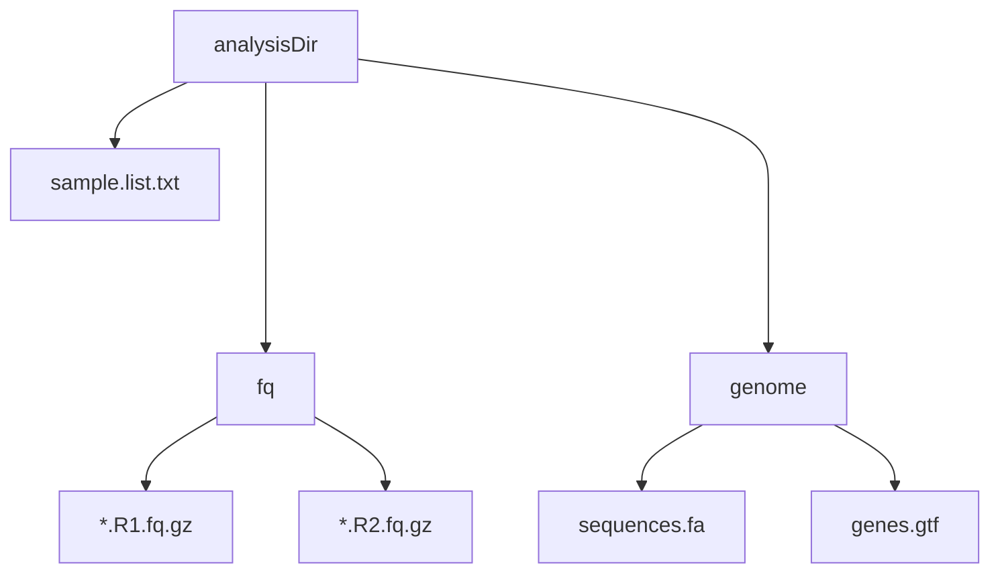

### Feature

- OneKey analysis from clean reads to variant VCF
- support multiple sample analysis
- parallel computing by default
- all analysis commands saved in files
- **Servers with large memory recommended**
- No QC procedure, using Clean reads as input

### input file directory prepare
 


### Dependencies

install dependencies using conda:

```bash
mamba create -n WGS perl=5.26.2 gatk4=4.2.5  bwa=0.7.17  samtools=1.15  vcftools=0.1.16 snpeff=5.1 python=3.7 parallel=20211222 bcftools=1.15 multiqc=1.12
```
### Usage

```bash
#activate environment 
conda activate WGS

#change working directory to analysisDir
cd /mnt/d/workshop/3.ReSeq

#run
bash onekeyReseq
```

### Results

|directory|meaning|
|-|-|
|1.mapping|mapping results<br>`mapStat.html` is the analysis report|
|2.SNP|SNP/InDel Results<br>`snp.indel.anno.addid.vcf` is the final variant file|
|commands|`.sh` is the detail commands <br>`.sh.ok` means the step is done normally|
|log|log files<br>`stdout.log` is the log of standard output，`stderr.log` is the log of standard error|


